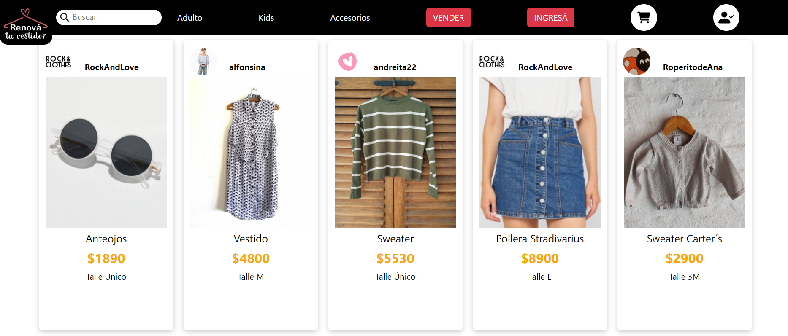

# Proyecto E-Commerce: CoderHouse

### Alumno: Gustavo Torres

Este proyecto fue creado con el cli de React [Create React App](https://github.com/facebook/create-react-app).

## Para levantar el proyecto, utilizar el siguiente comando

### `npm start`

La app abre en el puerto:  [http://localhost:3000](http://localhost:3000)

Las dependencias que se utilizaron para este proyecto son: 

- [ ] Firebase
- [ ] Material UI
- [ ] Axios
- [ ] Bootstrap
- [ ] FontAwesome

 Click <a href="React App - Google Chrome 2022-10-14 21-18-15.gif">Aquí</a> para ver la animación .gif de la aplicación

